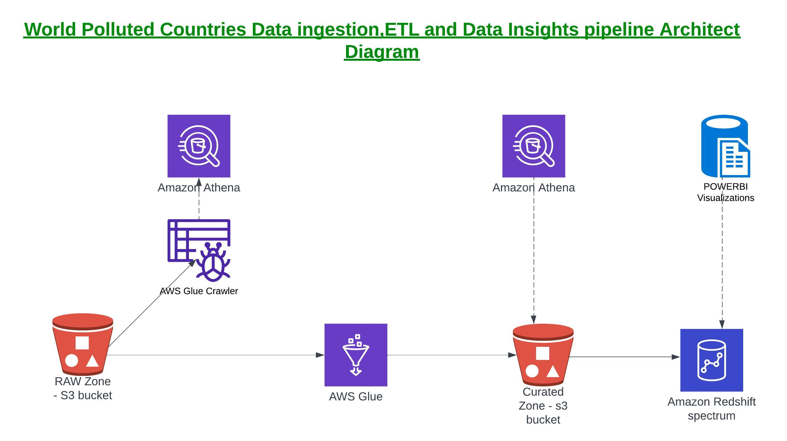
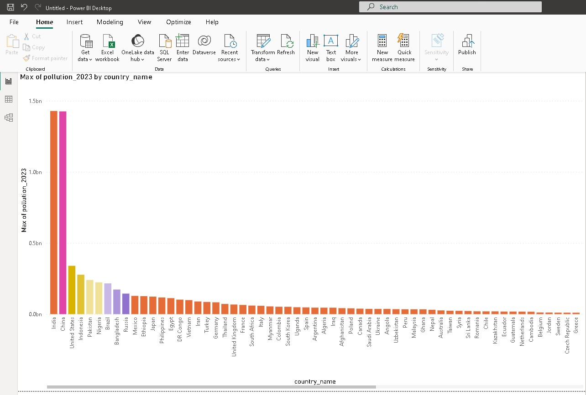
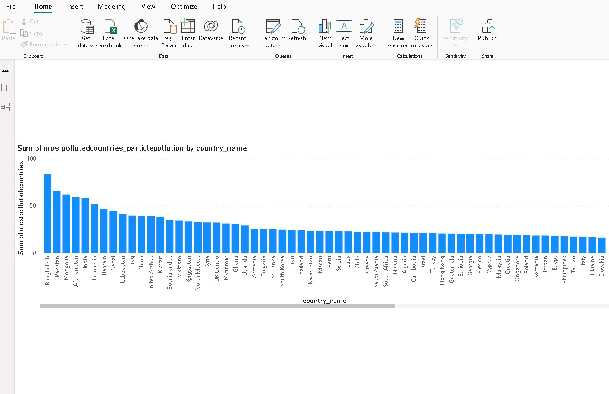
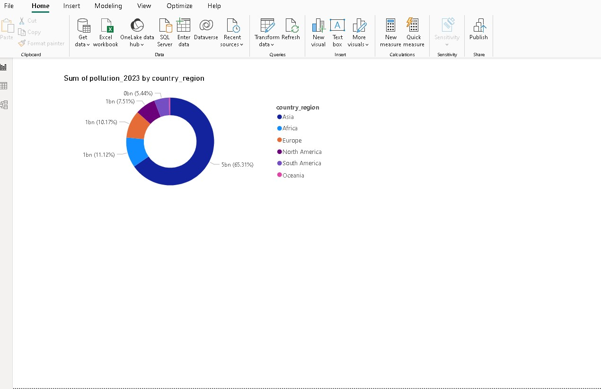
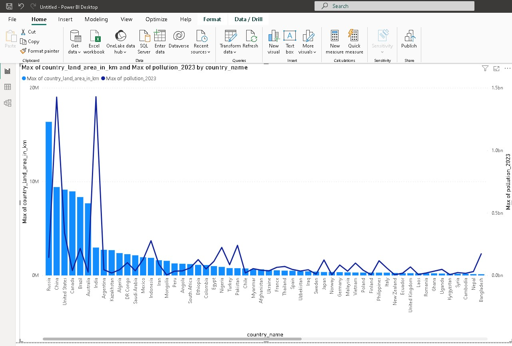

*************Project 1*****************

Project Title - World Polluted Country Data Insights

Description : 
Purpose of this project is to build Data Pipeline and Data Insights visualization is to ingest data into raw zone and then transform and store into curated zone after cleanup and transform and then make it available to ATHENA and Redshift spectrum to query. Use Microsoft powerbi data analytics tool to build visualization and show below.
1. 10 Most polluted countries in the world
2. Pollution by Country_Region or continental in the world
3. Pollution 2023 level by country_land_area size
4. Pollution by pollution particles rate by countries in year 2023

Architect Diagram of Data Pipeline and Tools / AWS services used are below.

Getting Started
To start working on this project you need to AWS free-tier account because we are going to use AWS S3, AWS Glue, AWS Athena, AWS IAM, AWS cloudformation, AWS Redshift services.
Also you need to have Microsoft POWERBI tool installed on your Windows Laptop to do data visualization needed at the end of this setup. 
I have used Microsofy Visual Souce Code tool to setup my code repository and uploaded to GitHub where all codes, configurations, images and codes are avvailable from this project.

Configuration: You need to configure s3 bucket, Glue Jobs, IAM permissions, Glue crawler . Most of cloudformation template needed to create Glue crawler, Glue Jobs and IAM are atatched herewith but some objects like AWS S3 bucket and Redshift cluster are created using AWS Console. I plan to add the Cloudformation template for S3 bucket and Redshift cluster as enhancements to this infrastructure build. Generally when project has been build first time then next steps is optimization and automation to deploy it beyond DEV environments like QA/UA/Prod. 

Folder Structure :
Below is a folder structure of this project.
1. clf_template : I have kept Glue crawler and Glue Job coludformation template here. Plan to add s3 bucket and Redshift cluster template in future.
2. config : This is where configuration details for Redshift connection from powerbi are kept as an example. I have to twick redshift security group to allow my connection from outside VPC group by adding TCP connection from Internet.
3. data : This is where I kept data files for raw-zone which I downloaded from "Keggle website". It is called most-polluted-countries.csv. After running Glue Job, I stored this transformed data file as "polluted_contries_curated.csv". There are tow columns removed from incoming data file in this schema transformation namely "united_nation_Member" and "share_borders". This was simple transformation build using GLUE Visual ETL job interface. Finally when data is extracted from Redshift Query editor and stored as file "polluted_contries_redshift.csv". This is a attempt to get a Medallion Architecture in pipeline called as "Bronz or raw data", "silver or curated data" and "Gold or aggregated data" in pipeline
4. ddl : This folder has been used to store data defination files used by ATHENA table or Glue catalogue table and Rdshift spectrum extrenal schema creation and Redshift spectrum external Table creation.
   polluted_countries.sql  - This can be used to create ATHENA table to view "curated data" 
   polluted_countries_ext.sql - This can be used to create a Redshift EXTERNAL table creation. Please create external database in Glue and EXTERNAL SCHEMA in Glue from Redshift Query editor if needed.
   cre_ext_schema.sql  - This script is used to create external Glue schema from Redshift Query editor which becomes visible in Redshift DEV database schema in this case. Once schema is created then you can create EXTERNAL tables.
5. images - This folder has all images used for the purpose of Data Engineering Architect Diagram or POWERBI data visualization attached in this introduction of project.
   Folliwng images are there 
   a. Data_pipeline_diagram_polluted_countries.jpeg - This image shows Data Pipeline Architecture and data flow of this whole project.
   b. pollution_2023_by_countries.jpeg  - This image shows powerbi visulization and shows Most polluted countries in the world
   c. polluted_countries_by_p_particles.jpeg - This image shows powerbi visualization and shows polluted countries by particle pollution content
   d. sumofpollution_2023_by_region.jpeg - This image shows powerbi visualization and shows most polluted regions or continental in the world
   e. country_land_area_pollution.jpeg - This image shows powerbi visualization and shows most pollution of countries related to their land size.

Data Pipeline flow :
First data gets downloaded from data sources like "KEGGLE website" in the form of CSV file , this file gets ingested in S3 bucket by upload. Glue crawler job starts and create a Table in Glue catalogue for this file. After this, this file  gets curated, transformed and puts curated data into another S3 bucket by AWS Glue Job. This Glue Job in this example also create another ATHENA table on this curated data bucket in Glue Catalogue. At this point data is ready for further analysis. In this example , Redshift cluster is used for data query purpose using Redshift SPECTRUM capability. POWERBI tool connects Redshift database using Redshift server endponts connection and imports data into POWERBI desktop. This data is then converted into POWERBI reports, Model and Visualization. Using POWERBI desktop, various visialization are created to fulfill the Projects end objective of DATA INSIGHT for world pollution in year 2023.

POWERBI Visualization :
1.pollution_2023_by_countries.jpeg  - This image shows powerbi visulization and shows Most polluted countries in the world. India leads world in pollution behind China. USA comes at third and then Indonesia and Pakistan takes next place. It is interesting to observe that USA comes third country in this world pollution report.
 

2.polluted_countries_by_p_particles.jpeg  - This image shows powerbi visualization and shows polluted countries by particle pollution content. Bangladesh which is very small country and then Pakistan  leads world in pollution by particle content category in the world. Very interetsing facts comes out of this data insights which helps to address the issues in the world.This is a power of data driven decisions.
 

3.sumofpollution_2023_by_region.jpeg  - This image shows powerbi visualization and shows most polluted regions or continental in the world. Asia continental leads world in pollution due to India and China have maximum pollution in the world. Second comes "Africa" and not "North America" which is intersting to find out in this study.
 

4.country_land_area_pollution.jpeg  - This image shows powerbi visualization and shows most pollution of countries related to their land size. Russia size is big in land area but pollution is small while India's land size is small but pollution level in year 2023 report is high and same applies to China.
 

Further thoughts :

 There colud be further enhancements for this project by adding below
    Automate Infrastructure : Build cloudformation template to build whole infrastructure and automate all steps to create services, pipeline
    Pipeline Orchestration : Use AWS step function or Apache AIRFLOW to automate data pipeline run 
    

