# AWS KINESIS Real time Hospital Patient Blood Pressure IOT streaming, ingestion, Monitoring and Notification Project 

!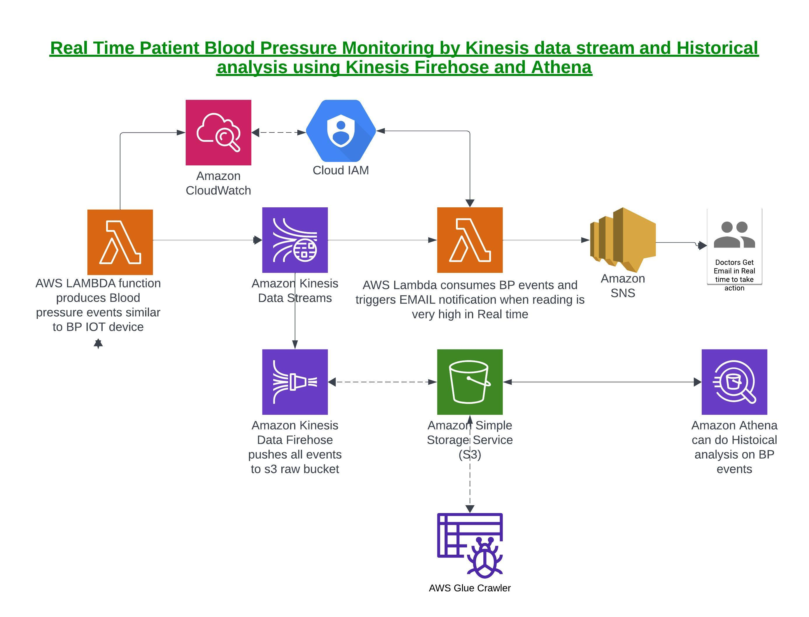


###  This is really good project to understand Real time streaming data from IOT devices like Blood pressure Monitors and Real time Notifications to Doctors or Nurses to take action. Not only real time data streaming but data can be ingested in s3 bucket or DynamoDB or Redshift for Historical Analysis purpose. In this project data is stored in s3 bucket and analyzed using AWS ATHENA Query tool.
### For this project, we are going to  simulate Blood pressure IOT device event streaming using "AWS Lambda function" using Kinesis producer functionality

### Purpose of this project is to show the KINESIS streaming capabilities for REAL TIME event processing for critical actions in real life


## Requirements
- Basic KINESIS streams, Kinesis Firehose knowledge
- Basic knowledge kinesis BOTO3 functionality for Lambda function python code
- Intermediate level Python
- Basic knowledge SQL
- Basic knowledge AWS S3, Lambda, Glue, Athena, SNS, IAM services

## Folders in this project source code on Github 
1. pyscripts - This folder contains python code for kinesis producer , consumer functionality, addtional test code for consumer function is also there
2. data - This folder contains JSON file to show the s3 events ingested in s3-bucket
3. ddl   - This folder contains DDL to create Glue catalogue table needed for query of data for ATHENA . You can also use Glue crawler for this instead.
4. images - This folder contains image of architect diagram of this project of this project and various steps needed to build this project
5. athena_queries - This folder contains "athena queries for data analysis on patient's who have BP issues for historical analysis purpose
6. config - This folder has IAM policy needed for Lambda fuction both producer and consumer. Use this policy to create Lamba IAM role.


## To do list step by step - Real time streaming and Alert Notification part 1

## 1.1. create AWS S3 Bucket
Go to AWS S3 page and create a bucket. My bucket name is 'sbhujbal123'.
Create folders
 athena_logs - to store athena query logs 

!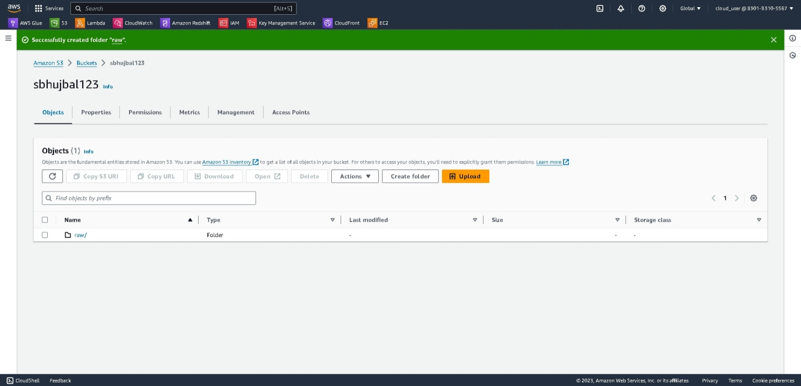

## 1.2. create AWS IAM role - Later needed when you create Lambda function
Go to AWS IAM page and create a IAM policy first using policy JSON file from config folder. After policy is created then create IAM role for Lambda service and attach
IAM policy you created.

!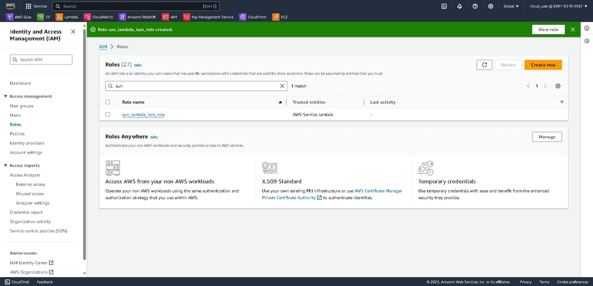

## 1.3. create AWS KINESIS data stream 
Go to AWS KINESIS page and create a  Kinesis stream called as => Bloodpressure_iot_stream

!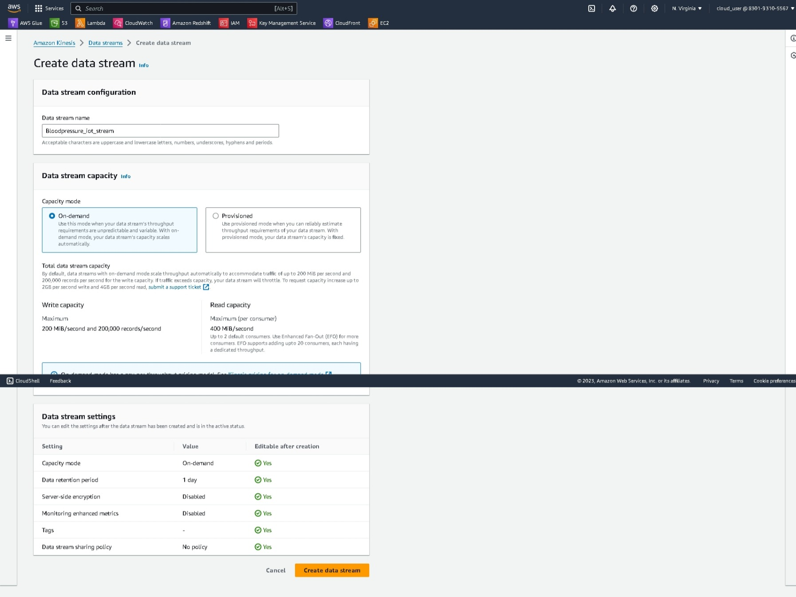

## 1.4. create AWS SNS topic 
Go to AWS SNS page and create  SNS topic and save ARN of topic and put in Lambda code

!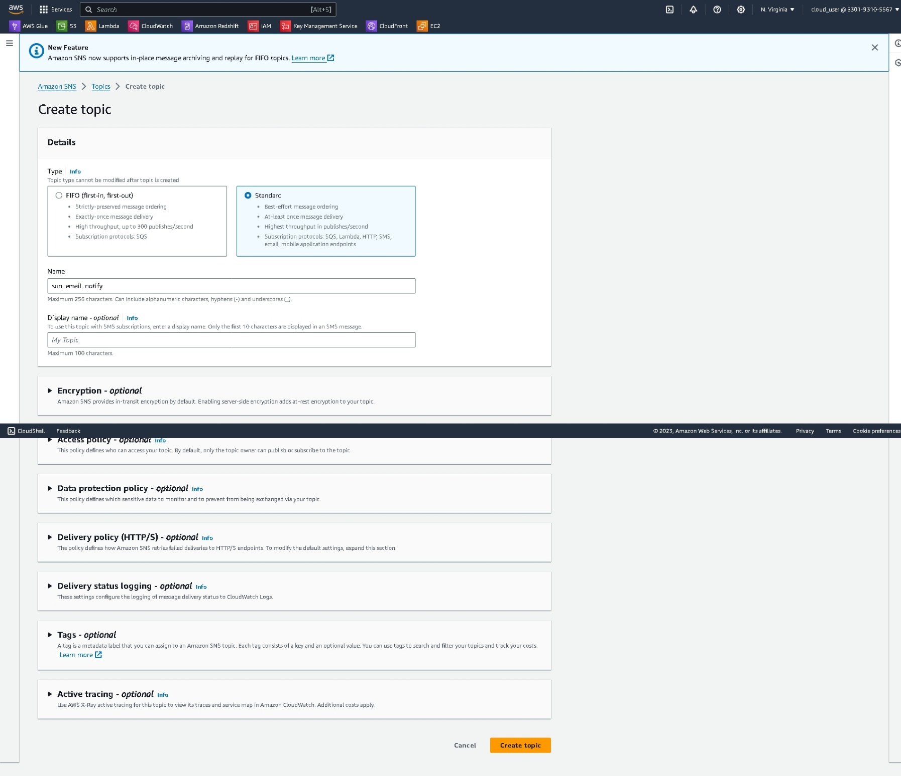

## 1.5. create AWS SNS topic subscriber Email ( Use your Email for this testing !!!)
Go to AWS SNS page and create  SNS topic subscriber, once you get Email, confirm your subscription and verify again in AWS console

!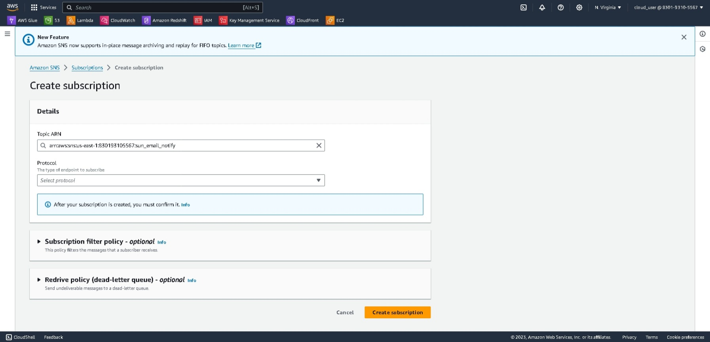

## 1.5. create producer lambda function 
Go to AWS Lambda page and create  Lambda function, use python language 3.12 , paste code from pyscripts folder in code section in this function => produce_bp_events.py. Deploy it and TEST it using default config for time-out - 3 sec.
Go to Kinesis stream and in Metrics - check for Incoming data. If you see that data events are getting into Kinesis stream then proceed further.

!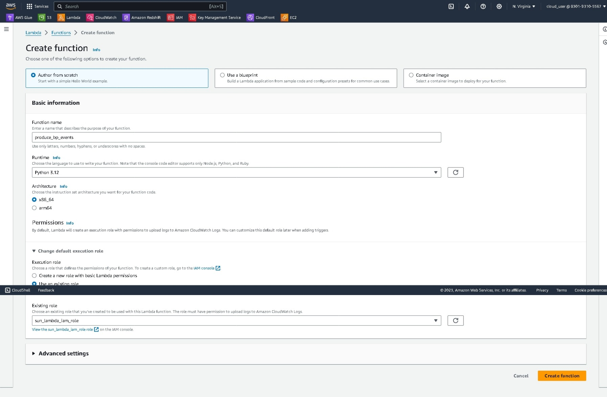


## 1.5. create consumer lambda function and TEST for event consumption and alert notifications if needed for critical data 
- Go to AWS Lambda page and create  Lambda function for stream consumer, use python language 3.12 , create trigger for this function from Kinesis stream above , paste code from pyscripts folder in code section in this function => consumer_test_code.py Deploy it and 
- TEST it using  config for time-out of 30 sec for producer lambda function.
- Go to this consumer Lambda function and in tab Monitor, click on Cloudwatch logs and verify event Records - check for Incoming data in cloudwatch log streams. If you see that data events are getting cosumed by this Lambda function then proceed further. 
- Next step is paste code from pyscripts folder in code section in this function => consumer_test_code.py Deploy it and 
- TEST it by using config for time-out of 5 min in the producer lambda function.
- Once stream events are consumed and analyzed by consumer Lambda , it will send SNS notification to your Email, confirm you get EMAIL notifications 
- If you see Email notifications then this Real Time Notification part is working which is main goal of streaming platforms

!


Below is where you go into cloudwatch logs and verify events are getting consumed by consumer lambda when test code id used.

!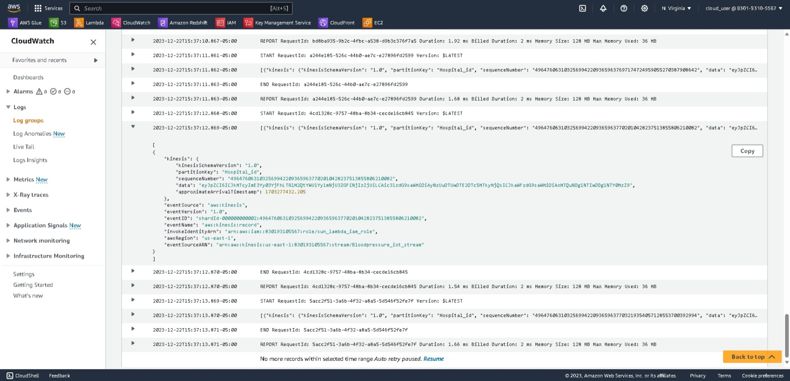

Below image shows where to change config - time out value of lambda fucntion( keep in mind here producer lambda function )

!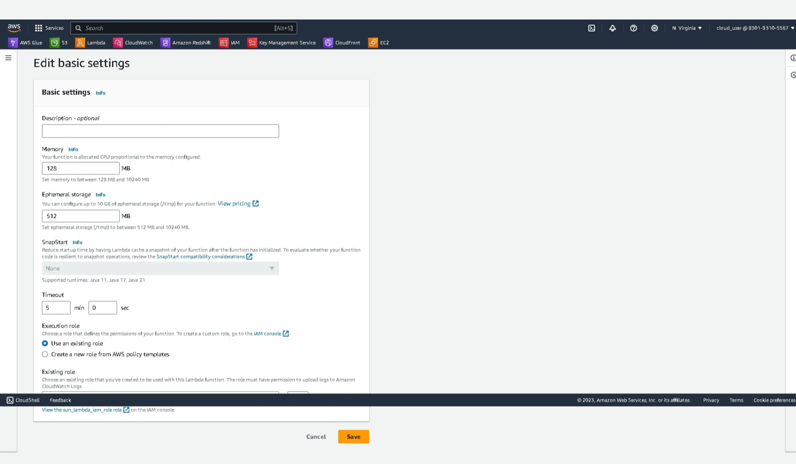

Below image shows when SNS notifications send Email, you will see EMAIL notifications when Blood pressure exceeds ceratin values. Very cool !!!

!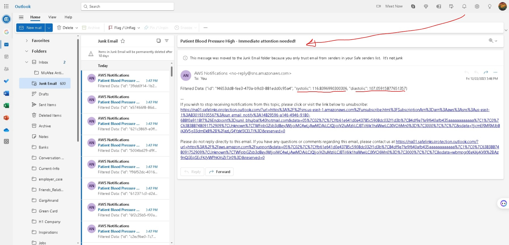


## To do list step by step - Real time streaming and Historical Data Analysis using ATHENA -  part 2

## 2.1. create AWS Kinesis Data Firehose and TEST it
- Go to AWS kinesis page and create a KDF . 
- Use above Kinesis stream as source and S3 bucket defined in earlier step as Target.
- Change default "Buffer Interval" from 600 sec to 60 sec.
- Next steps is TEST that KDF moves data events into S3 bucket
- TEST your producer Lambda Function with time-out of 5 min.This function will generate events and KDF will consume them and move them into s3 bucket at 60 sec. interval
- If you see data in S3 bucket then you are done !

!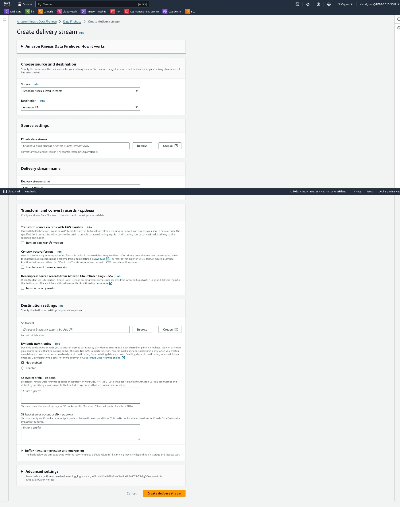

Below image shows - Change default "Buffer Interval" from 600 sec to 60 sec. for this testing in KDF ( Kinesis Data Firehose )

!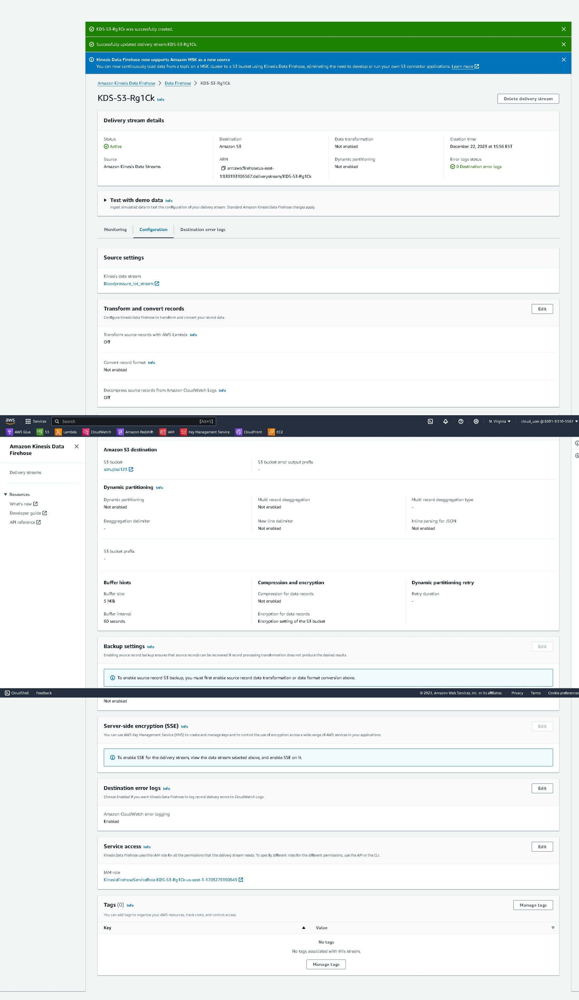

# 2.1. create AWS Glue Crawler and RUN it
- Go to AWS Glue page and create Glue Crawler on s3 bucket
- Run crawler and check that ATHENA table is created and ready for Query and Historical Analysis.

!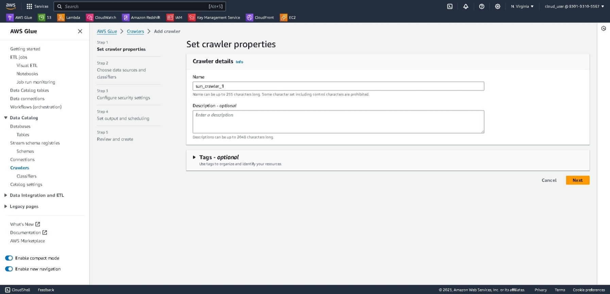

**## 6. Athena Analytics**
- Run the code here in Atena_queries folder to analyze abnormal blood pressure readings from different patient devices
- Prepare report for analysis and action plan 
     ```SELECT id as device_ID,
            systolic systolic_pressure,
            diastolic as diastolic_pressure
        FROM "sundb"."sunsbhujbal123" bp
        where ( bp.systolic >= 200  ) or (bp.diastolic >= 120)
    ```


**# That's it. This is the end of this project. Thank you for your interest.**


